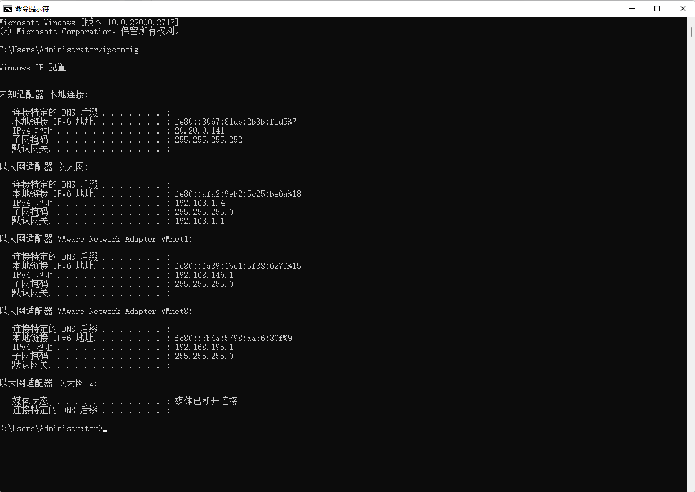

# 项目介绍

- setting\setup_static_ip.sh：设置动态IP信息为静态IP

# 构建实验环境

例如本代码是在windows宿主机上编写，但是实验环境是vmware虚拟机

为了担心虚拟机的损坏，所以将代码放到windows编写

在同一网络通信，为了方便运行代码，windows开启共享代码目录

## vscode

打开命令面板：按 Ctrl+Shift+P（或 Cmd+Shift+P 在 macOS 上）打开命令面板。
搜索并选择：输入 Change End of Line Sequence 并选择这个选项。
选择行尾格式：在弹出的选项中选择 LF（Linux 格式）或 CRLF（Windows 格式）。

## Windows开启SMB共享


Vmnet1、Vmnet8是虚拟机网卡，以 `VMware Network Adapter` 开头的都是网卡




Vmware软件菜单栏-编辑-虚拟网络编辑器，可以通过名称和类型来确认


## Linux配置SMB客户端

1.安装 mount.cifs，用于挂载SMB共享目录
```sh
yum install cifs-utils
```

2. 查看共享

```sh
sudo yum install samba-client
smbclient -L //192.168.1.100 -U guest

```

如果没有出现你的共享，是不是没有点 应用，导致还没有生效

```
# smbclient -L //192.168.195.1 -U administrator
Enter SAMBA\administrator's password: 

	Sharename       Type      Comment
	---------       ----      -------
	Devops          Disk      
	IPC$            IPC       远程 IPC
	scrpt_shell     Disk      
Reconnecting with SMB1 for workgroup listing.

```

注意目录得创建，IP共享目录、用户名、密码都是对的，否则会有报错
```
//192.168.195.1/tools_shell  /mnt/script cifs username=administrator,password=asdsadsadasdasasd,vers=3.0,_netdev,nofail 0 0

```